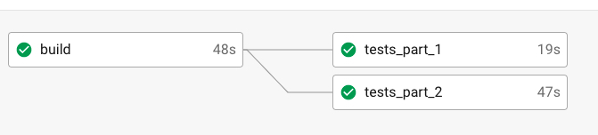

### Run Cypress tests in Parallel without using paid [Dashboard](https://www.cypress.io/dashboard/)



All we need to do is split the tests into parts `package.json` that we want to run in `CircleCI` in different Docker containers.
```json
  "scripts": {
    "cy:run:part_1": "cypress run --browser chrome --spec ./cypress/integration/1-getting-started/todo.spec.js",
    "cy:run:part_2": "cypress run --browser chrome --spec ./cypress/integration/2-advanced-examples/actions.spec.js"
  },
```

And in the same order, keep them organize in `CircleCI`

```yaml
workflows:
  version: 2
  build_and_test:
    jobs:
      - build
      - tests_part_1:
          requires:
            - build
      - tests_part_2:
          requires:
            - build
```

- If you have difficulty reading [.circleci/config.yml](.circleci/config.yml) I suggest you analyze a simpler version [gist.github.com/Ebazhanov/6b0...](https://gist.github.com/Ebazhanov/6b0434132145e0b1ef67b07201c6cde0)

- Also, if you still want to use Cypress Dashboard, then here's their price list [cypress.io/pricing/](https://www.cypress.io/pricing/)

See my examples with generating **HTML** Reports for Cypress tests
- ⭐ [Allure-2](https://github.com/Ebazhanov/cypress-allure2-report-example)
- 👍 [mochawesome-html-report](https://github.com/Ebazhanov/cypress-mochawesome-html-report-example)


